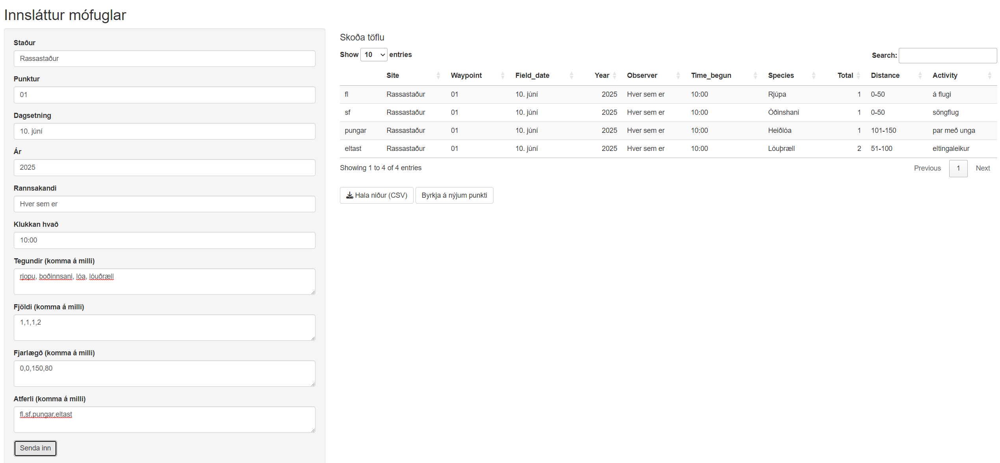

# mofuglar_innslattur

Þægileg leið til að slá inn gögn í excelskjalið fyrir monitoring gagnagrunninn.

## Sjálfvirk leiðrétting og flokkun gagna

Vegna þess að innlestur gagna með ókeypis raddhlustunarforritum fyrir íslensku er oft ónákvæmur, getur verið algengt að tegundanöfn og aðrar upplýsingar séu rangt skrifaðar eða með stafsetningarvillum. Til að leysa þetta notar Shiny appið svokallaða "fuzzy matching" aðferð til að bera kennsl á og leiðrétta ranglega skrifuð orð fyrir fuglategundir. Þetta þýðir að jafnvel þó að tegundarnafn sé ekki nákvæmlega rétt skrifað, reynir appið að finna líkasta réttnefnið úr lista yfir þekktar tegundir og leiðréttir það sjálfkrafa.

Auk þess flokkar appið fjarlægðir í rétta flokka samkvæmt fyrirfram skilgreindum viðmiðum, þannig að jafnvel þó fjarlægð sé slegin inn á mismunandi hátt, þá er hún vistuð á stöðluðu formi sem auðveldar úrvinnslu gagna.

Þegar öll gögn hafa verið leiðrétt og flokkuð, býr appið til CSV skrá sem er sniðin sérstaklega til að vera samhæfð við skráningarkerfi NÍ. Þetta gerir það einfalt að hengja skrána við excel-skjalið frá NÍ eða flytja gögnin beint inn í gagnagrunninn þeirra.

Ástæða þess að þessi sjálfvirka leiðrétting og flokkun er notuð, er að tryggja að gögn sem safnað er með raddhlustun (sem getur verið ónákvæm fyrir íslensku) séu rétt og nothæf fyrir áframhaldandi úrvinnslu og vistun í opinberum gagnagrunni.

## Skjámynd

